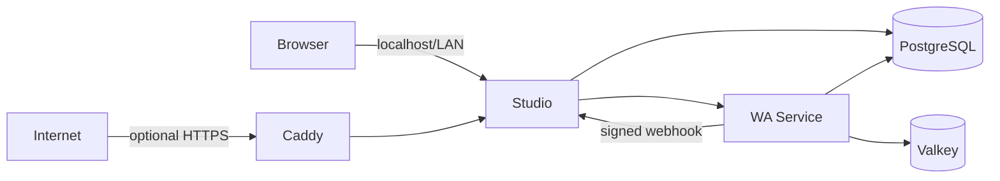

# Monra Deployment

[Português (Brasil)](./README.pt-BR.md)

The supported, beginner-friendly way to run the complete Monra stack on one server. This repository does not merge the application source histories: it coordinates versioned images from [Monra Studio](https://github.com/ramon-victor/monra-studio) and [Monra WA Service](https://github.com/ramon-victor/monra-wa-service).

That separation keeps each component independently testable and releasable while giving operators one installation, upgrade, backup, and recovery workflow.

## Architecture



- Only Studio is published by default, bound to `127.0.0.1:5522`.
- WA Service, PostgreSQL, and Valkey are not exposed on host ports.
- PostgreSQL uses separate roles and databases for Studio and WA Service.
- Studio migrations run once and must succeed before Studio starts.
- Webhooks are authenticated with HMAC-SHA256 over the exact request body.
- Infrastructure images are pinned by multi-platform digest. Application images are pinned by release tag until their first published digest is available.

See [Architecture](./docs/en/architecture.md) for the decisions and tradeoffs.

## Requirements

- A Linux server, macOS, or Windows with WSL2
- Docker Engine with Docker Compose v2.20 or newer
- `curl`, `openssl`, Git, and Bash
- Recommended minimum: 2 CPU cores, 4 GB RAM, and 20 GB free disk

For a public installation, point a domain's A/AAAA record to the server and allow inbound TCP 80/443 plus UDP 443.

## Quick start

### Private installation on this computer

```bash
git clone https://github.com/ramon-victor/monra.git
cd monra
./monra install
```

Open <http://localhost:5522>. The installer generates independent credentials, stores them in `.env` with mode `600`, pulls the pinned images, applies migrations, and waits for readiness.

### Public domain with automatic HTTPS

```bash
./monra install --domain monra.example.com --email admin@example.com
```

Caddy obtains and renews certificates automatically. Ports 80 and 443 must reach this host.

### Trusted LAN only

```bash
./monra install --bind 192.168.1.50
```

This serves plain HTTP on that private address. Do not use `0.0.0.0` on an untrusted network; use the domain/HTTPS mode instead.

## Daily operations

```bash
./monra status
./monra logs studio
./monra doctor
./monra backup
./monra update
./monra stop
./monra start
```

Restore is intentionally explicit and validates checksums first:

```bash
./monra restore backups/20260901T120000Z
```

Backups contain database data, Valkey data, image versions, and secrets. Copy them to encrypted off-host storage and protect them like production credentials.

## Configuration

The installer creates `.env`; normal users should not copy the example manually. Optional AI provider keys remain blank and can be added later. Image versions and digests live in [`versions.env`](./versions.env).

- [Configuration reference](./docs/en/configuration.md)
- [Operations, backup, restore, and updates](./docs/en/operations.md)
- [Domain and HTTPS](./docs/en/https.md)
- [Troubleshooting](./docs/en/troubleshooting.md)
- [Security guide](./docs/en/security.md)

## Release model

Application repositories publish multi-architecture images from semantic version tags with SBOMs, provenance, and GitHub attestations. This repository pins the selected release. Updates are therefore reviewable and do not silently follow `latest`.

The initial configuration references `v0.1.0`. Those component tags must be published before a fresh remote installation can pull them.

## Important notice

Monra uses an unofficial WhatsApp Web integration. Use a dedicated number, obtain all required consent, follow applicable law and WhatsApp policies, and expect account or protocol compatibility risk. This project is not affiliated with WhatsApp or Meta.

## License and security

Licensed under [Apache-2.0](./LICENSE). Report vulnerabilities through [private vulnerability reporting](./SECURITY.md), never through an issue containing credentials or real message data.
