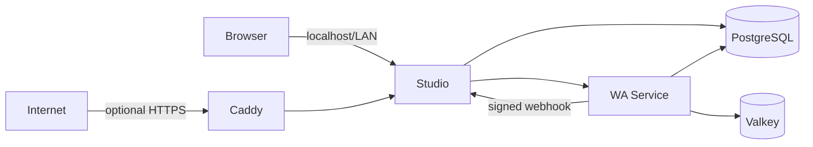

# Monra Deployment

[Português (Brasil)](./README.pt-BR.md)

Deploy and operate the complete Monra stack on a single host.

This repository contains the production deployment for [Monra Studio](https://github.com/ramon-victor/monra-studio) and [Monra WA Service](https://github.com/ramon-victor/monra-wa-service), including installation, upgrades, backups, and recovery.

## Prerequisites

- Linux, macOS, or Windows with WSL2
- Docker Engine with Docker Compose v2.20 or later
- `curl`, `openssl`, Git, and Bash
- At least 2 CPU cores, 4 GB RAM, and 20 GB of available disk space
- Access to the images selected in [`versions.env`](./versions.env). Public GHCR packages pull without sign-in; private packages require `docker login ghcr.io`.

## Quick start

### Local deployment

```bash
git clone https://github.com/ramon-victor/monra.git
cd monra
./monra install
```

When installation completes, open <http://localhost:5522>. The installer creates the runtime configuration, generates independent secrets, pulls the selected images, applies migrations, and waits for readiness.

### Internet-facing deployment with HTTPS

Point the domain's A/AAAA records to the host, allow inbound TCP 80/443 and UDP 443, then run:

```bash
./monra install --domain monra.example.com --email admin@example.com
```

Caddy obtains and renews the TLS certificate automatically.

### Private-network deployment (HTTP)

```bash
./monra install --bind 192.168.1.50
```

Use this mode only on an address protected by your private-network controls. For an Internet-facing deployment, use the domain and HTTPS mode instead.

## Architecture



- Studio is the sole service exposed on the host by default, bound to `127.0.0.1:5522`.
- WA Service, PostgreSQL, and Valkey remain on the internal Compose network.
- PostgreSQL uses separate roles and databases for Studio and WA Service.
- Studio migrations must complete before the application starts.
- Webhooks use HMAC-SHA256 over the exact request body.
- Every infrastructure and application image is pinned to a multi-platform digest.

See [Architecture](./docs/en/architecture.md) for design decisions and tradeoffs.

## Operations

```bash
./monra status
./monra doctor
./monra logs studio
./monra backup
./monra update
```

Restores are explicit and verify checksums before modifying data:

```bash
./monra restore backups/20260901T120000Z
```

## Documentation

The installer writes `.env`; do not copy the example file for a normal installation. Optional AI-provider keys are blank by default. Image selection is managed through [`versions.env`](./versions.env).

- [Configuration reference](./docs/en/configuration.md)
- [Operations, backup, restore, and updates](./docs/en/operations.md)
- [Domain and HTTPS](./docs/en/https.md)
- [Troubleshooting](./docs/en/troubleshooting.md)
- [Security guide](./docs/en/security.md)

## Release policy

`versions.env` is the deployment lockfile: it pins the exact image manifests that run on the host. Review changes to it before running `./monra update`. Component releases include multi-architecture images, SBOMs, and OCI provenance; this repository never follows `latest`.

## WhatsApp integration

Monra uses an unofficial WhatsApp Web integration. Use a dedicated number, obtain the required consent, comply with applicable law and WhatsApp policies, and account for the risk of account suspension and protocol changes. Monra is not affiliated with WhatsApp or Meta.

## Security and license

Monra is licensed under [Apache-2.0](./LICENSE). See [Contributing](./CONTRIBUTING.md) for the contributor workflow. Report vulnerabilities through [private vulnerability reporting](./SECURITY.md); never include credentials or real message data in an issue.
