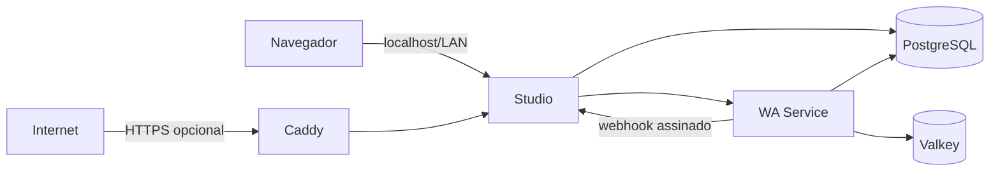

# Deploy do Monra

[English](./README.md)

Implante e opere a stack completa do Monra em um único host.

Este repositório contém a configuração de produção do [Monra Studio](https://github.com/ramon-victor/monra-studio) e do [Monra WA Service](https://github.com/ramon-victor/monra-wa-service), incluindo instalação, atualizações, backup e recuperação.

## Pré-requisitos

- Linux, macOS ou Windows com WSL2
- Docker Engine com Docker Compose v2.20 ou mais recente
- `curl`, `openssl`, Git e Bash
- Pelo menos 2 núcleos de CPU, 4 GB de RAM e 20 GB de espaço em disco disponível
- Acesso às imagens selecionadas em [`versions.env`](./versions.env). Pacotes públicos no GHCR são baixados sem login; pacotes privados exigem `docker login ghcr.io`.

## Início rápido

### Implantação local

```bash
git clone https://github.com/ramon-victor/monra.git
cd monra
./monra install
```

Quando a instalação terminar, abra <http://localhost:5522>. O instalador cria a configuração de execução, gera segredos independentes, baixa as imagens selecionadas, aplica as migrações e espera a prontidão.

### Implantação exposta à Internet com HTTPS

Aponte os registros A/AAAA do domínio para o host, libere TCP 80/443 e UDP 443 de entrada e execute:

```bash
./monra install --domain monra.exemplo.com --email admin@exemplo.com
```

O Caddy obtém e renova o certificado TLS automaticamente.

### Implantação em rede privada (HTTP)

```bash
./monra install --bind 192.168.1.50
```

Use este modo somente em um endereço protegido pelos controles da sua rede privada. Para uma implantação exposta à Internet, use o modo de domínio com HTTPS.

## Arquitetura



- O Studio é o único serviço exposto no host por padrão, vinculado a `127.0.0.1:5522`.
- WA Service, PostgreSQL e Valkey permanecem na rede interna do Compose.
- O PostgreSQL usa papéis e bancos separados para Studio e WA Service.
- As migrações do Studio precisam terminar antes da aplicação iniciar.
- Webhooks usam HMAC-SHA256 sobre o corpo exato da requisição.
- Todas as imagens de infraestrutura e aplicações são fixadas por digest multiplataforma.

Veja [Arquitetura](./docs/pt-BR/architecture.md) para decisões e concessões de projeto.

## Operação

```bash
./monra status
./monra doctor
./monra logs studio
./monra backup
./monra update
```

Restaurações são explícitas e verificam checksums antes de modificar dados:

```bash
./monra restore backups/20260901T120000Z
```

## Documentação

O instalador grava o `.env`; não copie o arquivo de exemplo em uma instalação normal. As chaves opcionais de provedores de IA ficam vazias por padrão. A seleção das imagens é gerenciada por [`versions.env`](./versions.env).

- [Referência de configuração](./docs/pt-BR/configuration.md)
- [Operações, backup, restauração e atualizações](./docs/pt-BR/operations.md)
- [Domínio e HTTPS](./docs/pt-BR/https.md)
- [Solução de problemas](./docs/pt-BR/troubleshooting.md)
- [Guia de segurança](./docs/pt-BR/security.md)

## Política de releases

`versions.env` é o lockfile do deploy: ele fixa os manifestos exatos de imagens executados no host. Revise as alterações nele antes de executar `./monra update`. As releases dos componentes incluem imagens para múltiplas arquiteturas, SBOM e proveniência OCI; este repositório nunca segue `latest`.

## Integração com WhatsApp

O Monra usa uma integração não oficial com o WhatsApp Web. Use um número dedicado, obtenha os consentimentos necessários, cumpra a legislação e as políticas do WhatsApp e considere riscos de suspensão da conta e mudanças de protocolo. O Monra não é afiliado ao WhatsApp ou à Meta.

## Segurança e licença

O Monra é licenciado sob [Apache-2.0](./LICENSE). Veja [Contribuindo](./CONTRIBUTING.pt-BR.md) para o fluxo de contribuição. Relate vulnerabilidades por [canal privado](./SECURITY.pt-BR.md); nunca inclua credenciais ou dados reais de mensagens em uma issue.
