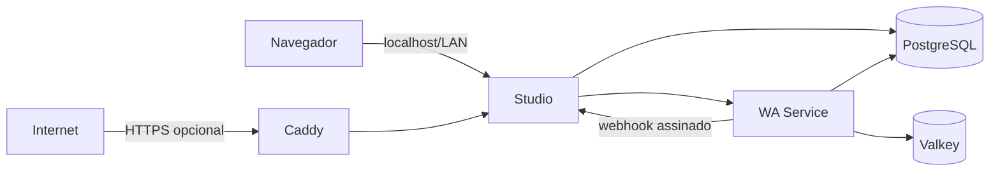

# Deploy do Monra

[English](./README.md)

A forma suportada e amigável para iniciantes executarem a stack completa do Monra em um único servidor. Este repositório não mistura os históricos dos códigos: ele coordena imagens versionadas do [Monra Studio](https://github.com/ramon-victor/monra-studio) e do [Monra WA Service](https://github.com/ramon-victor/monra-wa-service).

Essa separação mantém cada componente testável e publicável de forma independente, enquanto o operador recebe um único fluxo de instalação, atualização, backup e recuperação.

## Arquitetura



- Somente o Studio é publicado por padrão, em `127.0.0.1:5522`.
- WA Service, PostgreSQL e Valkey não expõem portas no host.
- O PostgreSQL usa papéis e bancos separados para Studio e WA Service.
- As migrações do Studio rodam uma vez e precisam concluir antes da aplicação iniciar.
- Webhooks são autenticados com HMAC-SHA256 sobre o corpo exato da requisição.
- Imagens de infraestrutura e aplicações são fixadas por digest multiplataforma; as referências das aplicações mantêm a tag semântica de release para facilitar a leitura.

Veja [Arquitetura](./docs/pt-BR/architecture.md) para decisões e concessões.

## Requisitos

- Servidor Linux, macOS ou Windows com WSL2
- Docker Engine com Docker Compose v2.20 ou mais recente
- `curl`, `openssl`, Git e Bash
- Mínimo recomendado: 2 núcleos de CPU, 4 GB de RAM e 20 GB livres

Para uma instalação pública, aponte os registros A/AAAA do domínio para o servidor e libere TCP 80/443 e UDP 443.

## Início rápido

### Instalação privada neste computador

```bash
git clone https://github.com/ramon-victor/monra.git
cd monra
./monra install
```

Abra <http://localhost:5522>. O instalador gera credenciais independentes, salva o `.env` com permissão `600`, baixa as imagens fixadas, aplica as migrações e espera a prontidão dos serviços.

### Domínio público com HTTPS automático

```bash
./monra install --domain monra.exemplo.com --email admin@exemplo.com
```

O Caddy obtém e renova certificados automaticamente. As portas 80 e 443 precisam chegar neste host.

### Apenas em uma LAN confiável

```bash
./monra install --bind 192.168.1.50
```

Esse modo usa HTTP no endereço privado. Não use `0.0.0.0` em uma rede não confiável; prefira domínio com HTTPS.

## Operações do dia a dia

```bash
./monra status
./monra logs studio
./monra doctor
./monra backup
./monra update
./monra stop
./monra start
```

A restauração é propositalmente explícita e valida os checksums antes:

```bash
./monra restore backups/20260901T120000Z
```

Os backups contêm bancos, dados do Valkey, versões das imagens e segredos. Copie-os para armazenamento externo criptografado e proteja-os como credenciais de produção.

## Configuração

O instalador cria o `.env`; o usuário normal não precisa copiar o exemplo manualmente. As chaves opcionais de provedores de IA ficam vazias e podem ser adicionadas depois. Versões e digests ficam em [`versions.env`](./versions.env).

- [Referência de configuração](./docs/pt-BR/configuration.md)
- [Operações, backup, restauração e atualização](./docs/pt-BR/operations.md)
- [Domínio e HTTPS](./docs/pt-BR/https.md)
- [Solução de problemas](./docs/pt-BR/troubleshooting.md)
- [Guia de segurança](./docs/pt-BR/security.md)

## Modelo de releases

Os repositórios das aplicações publicam imagens multiplataforma a partir de tags semânticas, com SBOM e proveniência OCI. Repositórios públicos dos componentes também publicam atestações de artefatos do GitHub; os privados mantêm os metadados OCI porque o GitHub limita esse recurso nesses casos. Este repositório fixa a release escolhida. Assim, atualizações são revisáveis e nunca seguem `latest` silenciosamente.

A configuração inicial seleciona `v0.1.1` pelos digests publicados dos manifestos multiplataforma. Mover uma tag não consegue mudar os bytes da imagem escolhida por este deploy.

### Acesso aos pacotes

Para que o início rápido não exija login, os dois pacotes Container no GHCR precisam ser públicos. Tornar um pacote público não torna seu repositório de código público, mas expõe as camadas do container e não pode ser desfeito no GitHub. Se os pacotes permanecerem privados intencionalmente, cada operador precisa se autenticar com uma credencial de pacote somente de leitura antes de executar `./monra install`; veja [Solução de problemas](./docs/pt-BR/troubleshooting.md).

## Aviso importante

O Monra usa uma integração não oficial com o WhatsApp Web. Use um número dedicado, obtenha os consentimentos necessários, cumpra a legislação e as políticas do WhatsApp e considere riscos de bloqueio ou incompatibilidade de protocolo. Este projeto não é afiliado ao WhatsApp ou à Meta.

## Licença e segurança

Licenciado sob [Apache-2.0](./LICENSE). Relate vulnerabilidades por [canal privado](./SECURITY.pt-BR.md), nunca em uma issue contendo credenciais ou dados reais de mensagens.
